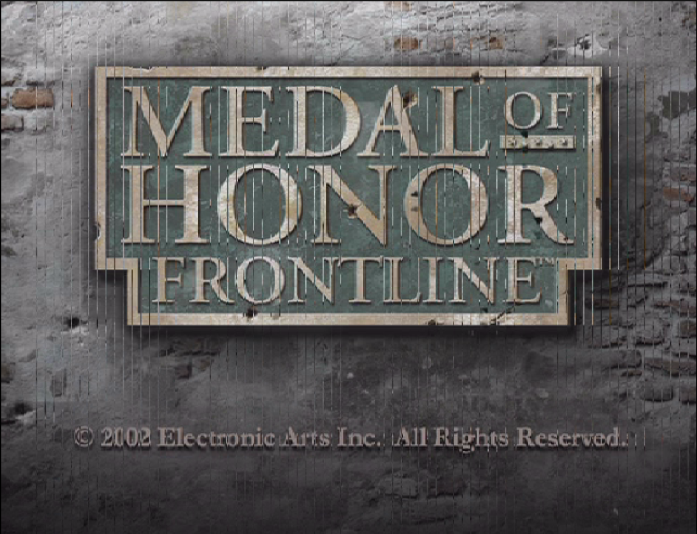
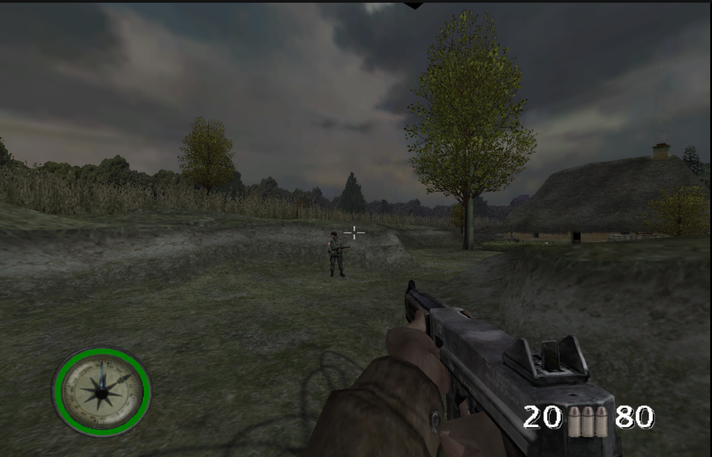
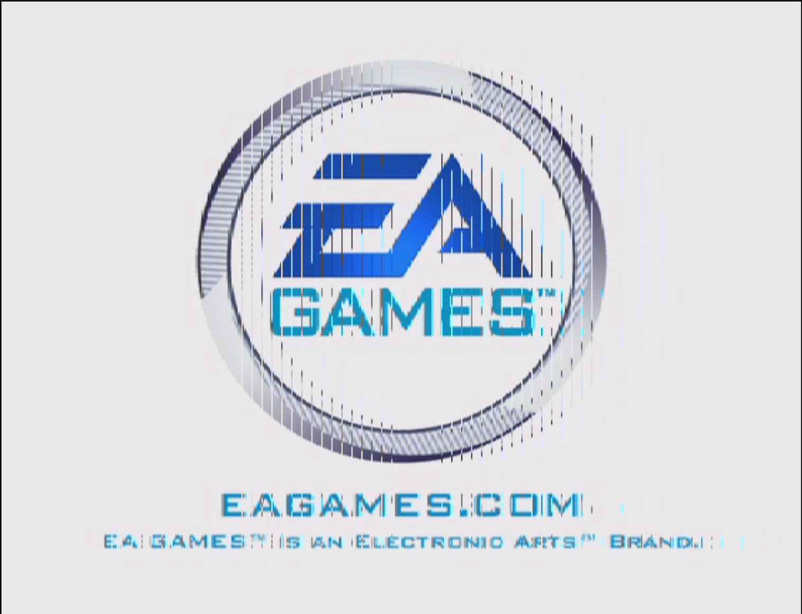
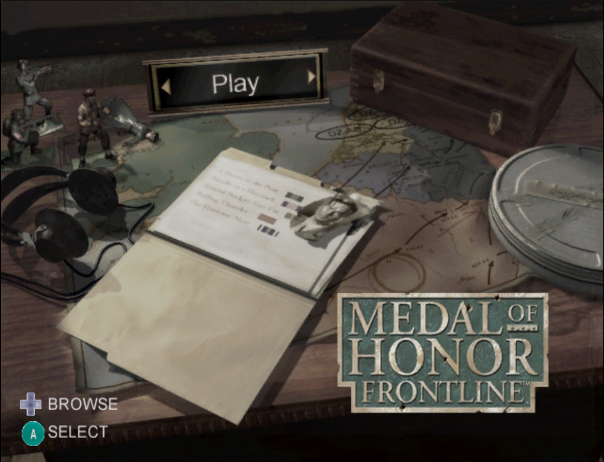
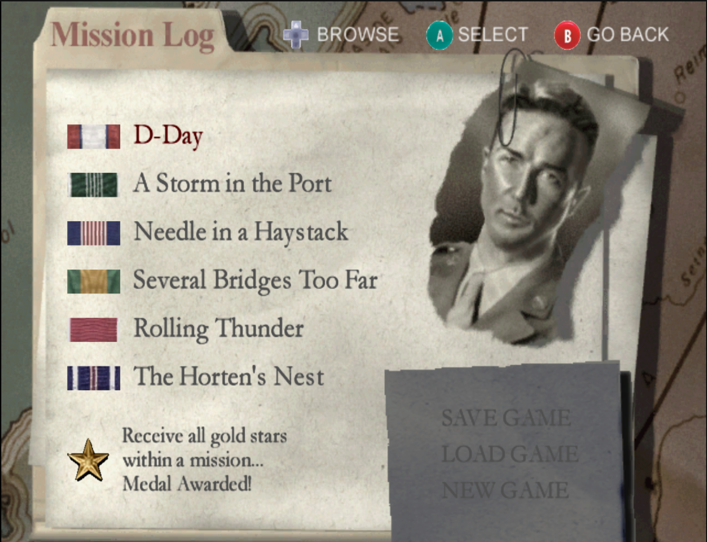
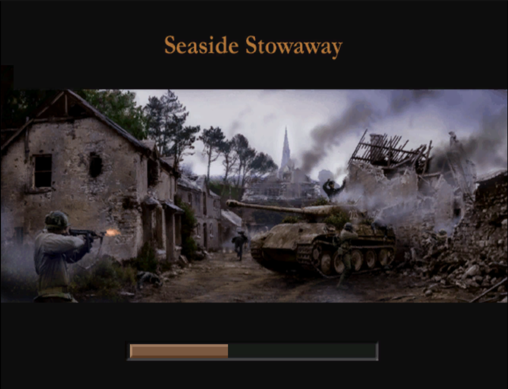
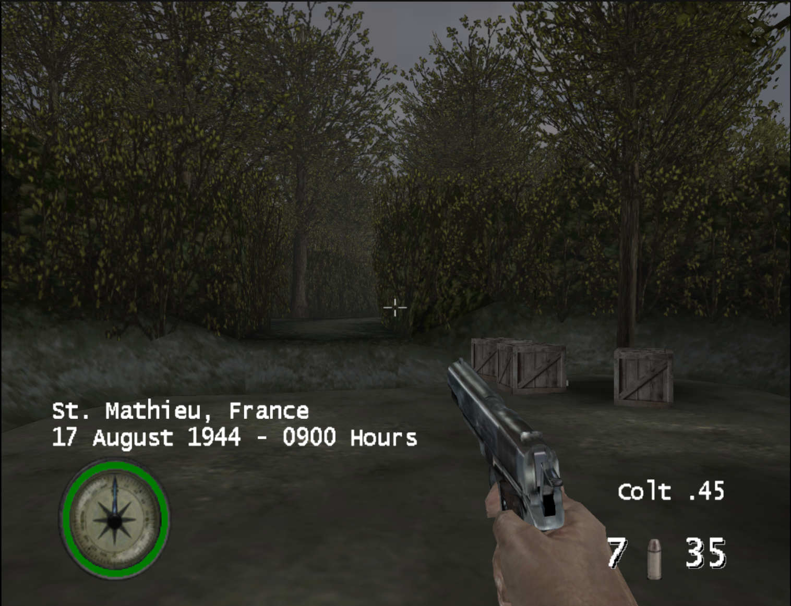

<div align="center">



# Medal of Honor: Frontline — GameCube Static Recompilation

**Experimental native PC recompilation of the USA GameCube release (`GMFE69`) using DolRecomp + ModernGekko.**

Linux · PowerPC → native C recompilation · Vulkan · Wayland · Multi-image ABI v5

</div>

<p align="center">
  
</p>

> [!IMPORTANT]
> This repository does **not** contain the original game ISO or extracted copyrighted game data. You must provide your own legally obtained USA GameCube copy of **Medal of Honor: Frontline** with disc ID **`GMFE69`**.

## Overview

This project statically recompiles the PowerPC executable code used by _Medal of Honor: Frontline_ into a native host shared library. ModernGekko provides the GameCube runtime environment around that native code: memory, exceptions, GX/video, audio, input, timing, DVD/filesystem services and executable-image switching.

Unlike a simple `main.dol` port, Frontline loads multiple executable images during normal gameplay. The build therefore discovers and recompiles the complete executable chain and links it into a single overlap-safe module:

```text
sys/main.dol / files/Moh2BootRel.dol
              │
              ├── files/Moh2RelGC.elf       main game executable
              └── files/Moh2StubRelGC.elf   restart / loader stub
```

The boot and stub images overlap in guest address space but contain different code. The project uses a **multi-image ABI v5** and runtime byte hashes to select the correct native implementation whenever executable memory changes.

## Current status

| Area | Status |
|---|---|
| GMFE69 detection and ISO extraction | ✅ |
| Multi-DOL / ELF discovery | ✅ |
| Native recompilation of boot, main and stub executables | ✅ |
| Overlap-safe runtime image switching | ✅ |
| Non-stripped ELF symbol recovery | ✅ |
| Native burst / dispatcher optimizations | ✅ |
| Main menu and mission selection | ✅ |
| Gameplay | ✅ experimental |
| Widescreen / custom FOV | ✅ |
| Configurable frame target | ✅ experimental |
| Long-session audio / low-address reads | 🚧 under investigation |

The project is usable for development and gameplay testing, but it is still an **experimental recompilation**, not a finished compatibility release.

## Screenshots

<table>
  <tr>
    <td></td>
    <td></td>
  </tr>
  <tr>
    <td></td>
    <td></td>
  </tr>
  <tr>
    <td></td>
    <td></td>
  </tr>
</table>

## Highlights

- **One native module for every executable image** used by GMFE69.
- **Runtime hash ownership** for overlapping boot/stub code instead of pretending both images are identical.
- **5,665 recovered named functions** from the non-stripped runtime ELF files.
- **DolRecomp MAP integration** so generated code keeps useful original CodeWarrior-style symbols.
- **O3 by default** for the generated native module.
- **Native burst enabled by default** only where multi-image ownership is unambiguous.
- Permanent GMFE69 post-generation optimizations through [`tools/gmfe69_postgen.py`](tools/gmfe69_postgen.py).
- Optional **aspect ratio, FOV and FPS controls** exposed directly by `run.sh`.
- No game-specific interpreter fallback range enabled by default.

Detailed optimization notes live in [`docs/GMFE69_OPTIMIZATIONS.md`](docs/GMFE69_OPTIMIZATIONS.md).

---

# Quick start

## 1. Clone

```bash
git clone <your-repository-url>
cd MOHFrontline-GC-RECOMP
```

## 2. Install build dependencies

The project currently targets **64-bit Linux**. You need at least:

- CMake 3.20+
- Ninja
- Python 3
- GCC or Clang
- `pkg-config`
- a working Vulkan driver/runtime
- Wayland development files and protocols
- `libxkbcommon`

On Arch Linux, a typical starting point is:

```bash
sudo pacman -S --needed \
  base-devel cmake ninja python pkgconf clang \
  wayland wayland-protocols libxkbcommon vulkan-icd-loader
```

ModernGekko/Dolphin may request additional development packages depending on your distribution and enabled host features. X11 is disabled by default in this project.

## 3. Add your own game

Put your legally obtained **USA GMFE69** ISO in:

```text
iso/MOH-FRONTLINE-USA.iso
```

The filename is only a convenience. If exactly one `.iso` exists in `iso/`, `build.sh` will use it automatically.

You can also point directly to a dump elsewhere:

```bash
ISO=/path/to/your/Medal-of-Honor-Frontline-USA.iso ./build.sh
```

If you already have an extracted GameCube filesystem, place it under `extracted/` instead:

```text
extracted/
├── sys/
│   ├── boot.bin
│   └── main.dol
└── files/
    ├── Moh2BootRel.dol
    ├── Moh2RelGC.elf
    ├── Moh2StubRelGC.elf
    └── ...
```

The build validates the six-character disc ID and refuses unsupported releases.

## 4. Build

```bash
chmod +x build.sh run.sh tools/*.sh tools/*.py
./build.sh
```

A clean build automatically:

1. builds a small DolRecomp ISO extractor;
2. validates and extracts your GMFE69 disc when needed;
3. configures and builds ModernGekko;
4. discovers every `.dol` and `.elf` recursively;
5. removes only exact byte-for-byte executable duplicates;
6. converts ELF load segments into address-preserving DolRecomp input;
7. recovers named ELF function symbols and creates function maps;
8. recompiles every unique executable image;
9. applies the permanent GMFE69 post-generation optimizations;
10. builds the overlap/hash tables for ABI v5;
11. links one `gGMFE69_recomp.so`;
12. publishes the runtime and module locally.

Generated output appears in:

```text
runtime/moderngekko-run
module/gGMFE69_recomp.so
module/multi-image-report.json
module/symbols/
```

These directories are intentionally ignored by Git.

## 5. Run

Original game behavior:

```bash
./run.sh
```

Widescreen:

```bash
./run.sh --aspect 16:9
```

16:10:

```bash
./run.sh --aspect 16:10
```

Ultrawide + custom FOV:

```bash
./run.sh --aspect 21:9 --fov 100
```

Custom frame target:

```bash
./run.sh --fps 60
./run.sh --fps 120
./run.sh --fps 144
```

Everything together:

```bash
./run.sh --aspect 3440x1440 --fov 100 --fps 144
```

Show launcher options:

```bash
./run.sh --moh-help
```

With no MOH-specific options, `run.sh` preserves the original FOV, aspect-ratio and frame-timing behavior.

---

## Runtime enhancement options

| Option | Description |
|---|---|
| `--aspect default` | Original presentation |
| `--aspect auto` | Derive aspect from `MOH_OUTPUT_SIZE` or host output when available |
| `--aspect 4:3` | Original aspect |
| `--aspect 16:10` | 16:10 widescreen |
| `--aspect 16:9` | 16:9 widescreen |
| `--aspect 21:9` | Ultrawide |
| `--aspect 32:9` | Super-ultrawide |
| `--aspect WIDTHxHEIGHT` | Arbitrary aspect ratio |
| `--fov N` | Final horizontal FOV, `20 <= N < 179` |
| `--fps N` | Target frame rate from 1 to 1000 |
| `--fps unlimited` | Remove the explicit target limiter |

For exact `auto` aspect detection under a pure Wayland session you can provide the output size yourself:

```bash
MOH_OUTPUT_SIZE=5120x1440 ./run.sh --aspect auto
```

> [!NOTE]
> Higher FPS targets are experimental. Game logic and timing were authored around the original console behavior, so not every target is expected to be equally stable.

## Build configuration

The normal native module is compiled at **O3**:

```bash
./build.sh
```

For debugging compiler/codegen issues:

```bash
MODULE_OPT_LEVEL=0 ./build.sh
```

Other useful build variables:

```bash
JOBS=8 ./build.sh
TOOLCHAIN=gcc ./build.sh
TOOLCHAIN=clang ./build.sh
RUNTIME_X11=ON ./build.sh
DOL_SHA256=<expected-main-dol-sha256> ./build.sh
```

The all-executable GMFE69 module currently requires the **C backend**.

## Multi-image recompilation

For the inspected USA release, the runtime executables are approximately:

| Image | Role | Generated chunks |
|---|---|---:|
| `sys/main.dol` / `Moh2BootRel.dol` | Boot / loader | 10 |
| `Moh2RelGC.elf` | Main game | 87 |
| `Moh2StubRelGC.elf` | Restart stub | 10 |

`Moh2BootRel.dol` is byte-identical to `sys/main.dol`, so the build records it as an alias rather than recompiling duplicate code.

The boot and stub images overlap around `0x8068....`. The ABI v5 selector hashes the executable bytes currently present in guest memory and selects the corresponding native image. Unknown hashes are rejected rather than dispatched to the wrong native function.

See [`docs/gmfe69-executables.md`](docs/gmfe69-executables.md) for the detailed executable layout.

## Recovered ELF symbols

The two runtime ELF images retain useful symbol tables:

- `Moh2RelGC.elf`: **5,005** named executable functions
- `Moh2StubRelGC.elf`: **660** named executable functions
- combined: **5,665** function symbols

Examples include:

```text
GameLoop__Fv
LoadTheGame__Fv
InitCORE__Fi
RestartGame__Fv
AdjustAim__FR8CVector3f
```

After a build the symbol inventory is published under `module/symbols/` as JSON, CSV, MAP and generated headers for reverse-engineering and profiling workflows.

## Permanent performance work

The build carries the validated optimizations in source control; you do **not** need to run local patch scripts after regeneration.

Current permanent work includes:

- native cache-control and generic SPR helpers instead of interpreter fallback;
- overlap-safe unique-image native burst;
- cached chunk lookup inside burst dispatch;
- direct image dispatch without a second binary search;
- GameCube `/12` timebase specialization;
- x86-64 hardware FMA target;
- GMFE69 idle-loop override at `0x80115F64`;
- CP gather-pipe and blocking-loop hot-path reductions;
- hot FP-availability specialization;
- particle renderer LFD reconstruction and validated MEM1 write fast paths.

Generated-code-specific work is reapplied by:

```text
tools/gmfe69_postgen.py
```

so deleting `port-build/` and rebuilding does not lose those optimizations.

Failed or unproven experiments are deliberately excluded from the default build; see [`docs/GMFE69_OPTIMIZATIONS.md`](docs/GMFE69_OPTIMIZATIONS.md).

## Inspect and profile

Inspect the executable images found in your extracted game:

```bash
./tools/inspect_game.sh
```

Profile a running build for 30 seconds:

```bash
./tools/profile_cpu.sh 30
```

For a temporary diagnostic fallback range:

```bash
STATICRECOMP_FALLBACK_RANGES=80000000-80000100 ./run.sh
```

No GMFE69 forced fallback range is enabled by default.

## Repository layout

```text
.
├── assets/                         README screenshots
├── docs/
│   ├── GMFE69_OPTIMIZATIONS.md
│   ├── bringup.md
│   └── gmfe69-executables.md
├── extracted/                      your extracted game; ignored
├── iso/                            your ISO; ignored
├── ModernGekko/                    runtime + Dolphin/DolRecomp sources
├── multi-module-template/          GMFE69 native-module template
├── tools/
│   ├── build_all_exec_module.py    discover / recompile / link all executables
│   ├── elf2dol.py                  ELF → address-preserving DOL container
│   ├── elf_symbols.py              recover ELF function symbols
│   ├── gmfe69_postgen.py           permanent generated-code optimizations
│   ├── inspect_game.sh
│   └── profile_cpu.sh
├── build.sh                        clean build / publish pipeline
├── run.sh                          launcher + optional PC enhancements
├── LICENSE
└── README.md
```

Generated locally and ignored by Git:

```text
.cache/
build/
port-build/
module/
runtime/
user/
```

## Clean rebuild

To verify that the repository is genuinely reproducible and does not rely on stale generated files:

```bash
rm -rf .cache build port-build module runtime user
./build.sh
./run.sh
```

The permanent post-generator means the GMFE69-specific generated-code optimizations are restored automatically during that clean build.

## Known issues

- Long gameplay sessions can currently expose repeated low-address reads, primarily from the game's sound/timbre parsing paths. The root cause is being investigated; speculative low-memory/ARAM remapping is intentionally **not** included as a production workaround.
- Custom high frame targets are experimental and may expose original-engine timing assumptions.
- Linux/Wayland is the primary tested host configuration.

## Legal

This project is an independent reverse-engineering/static-recompilation effort and is not affiliated with or endorsed by Electronic Arts, Nintendo, the original developers, or other rightsholders.

No original game ISO, DOL, ELF or extracted copyrighted game data is distributed in this repository. Users must provide their own legally obtained copy.

## License

Project code is distributed under the **GNU General Public License v3.0**. See [`LICENSE`](LICENSE).

Third-party components under `ModernGekko/` retain their own respective licenses and notices.
